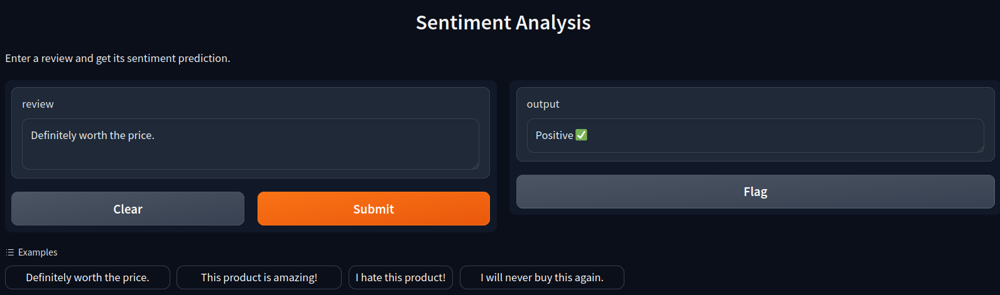

# Sentiment Analysis Project

---

## Description

This is a simple sentiment analysis project written in Python. The sentiment is classified as either positive or
negative with Logistic Regression model.
It uses [Amazon Review Data](https://www.kaggle.com/datasets/bittlingmayer/amazonreviews) dataset for training and
testing the model.
More information about the dataset can be found [here](data/README.md).

---

## Installation and Setup

### Prerequisites:

- Python 3.11^
- make
- Poetry

To install and set up the project, after cloning and navigating to the project directory, follow the steps below:

1. Install the required packages, create a virtual environment and additional setup:
    ```bash
    make install
    ```

2. Download the data and model from Google Drive:
    ```bash
    make download
    ```

---

## Usage

After the installation, you can use the following commands:

```
Usage:
  make <target>

Targets:
  help       - Show this help message
  download   - Download data & model from Google Drive
  install    - Install dependencies from pyproject.toml
  gui        - Run gradio-GUI using the model: model/model.pkl
  model      - Train and test the model using: data/train.csv, data/test.csv. Save the model to model/model.pkl
  prediction - Predict the sentiment of a given review using model/model.pkl.
               Example: make prediction review='This is a great product!'

```

This message can also be displayed by running `make help` or `make`.

### GUI

To run the GUI, use the following command:

```bash
make gui
```

This is a simple GUI created using Gradio, which allows the user to input a review and get a sentiment prediction.
It uses the model saved in `model/model.pkl` to predict the sentiment of a given review. The GUI
can be accessed from
the browser at the URL displayed in the terminal. The default URL is `http://127.0.0.1:7860`, but it may vary.
Additionally, with the `share` option set to `True`, the model is also hosted on a public URL, which is displayed in
the terminal.



### Prediction

To predict the sentiment of a given review in the terminal, use the following command:

```bash
make prediction review='This is a great product!'
```

This command will predict the sentiment of the given review using the model saved in `model/model.pkl`.

### Training the Model

To train and test the model, use the following command:

```bash
make model
```

This command will train and test the model using the data from `data/train.csv` and `data/test.csv`. The model will be
saved to `model/model.pkl`.

---

## Model

### Preprocessing Pipeline

The preprocessing pipeline consists of the following steps:

1. Data Cleaning:
  - Convert all words to lowercase.
  - Remove stopwords.
  - Remove punctuation.
  - Remove URLs.
  - Remove handles (e.g., Twitter handles).
  - Remove emojis.
  - Remove extra spaces.

2. Stemming:
  - Reduce words to their root form using a stemming algorithm.

3. Vectorization:
  - Convert text into a matrix of token counts.
  - Set the ngram_range parameter to (1, 2) to include both individual words and pairs of consecutive words.
  - Use a predefined constant MAX_FEATURES to limit the number of most frequent words, discarding less frequent words.

4. TF-IDF Transformation:
  - Transform the matrix of token counts into a normalized TF-IDF representation.
  - This step reduces the importance of frequently occurring words and increases the importance of rarely occurring
    words, which could be more informative.

### Classifier

The model uses a Logistic Regression classifier with the following hyperparameters after testing different values in
`/notebooks/model_experimentation.ipynb`:

- C: 7.9
- penalty: 'l2'
- solver: 'liblinear'

### Evaluation

The model was evaluated using the following metrics:

| Metric    | Value              |
|-----------|--------------------|
| Accuracy  | 0.8877980769230769 |
| Precision | 0.8867523580472798 |
| Recall    | 0.88915            |
| F1 Score  | 0.887949560498019  |

Confusion Matrix:

|                 | Predicted Negative | Predicted Positive |
|-----------------|--------------------|--------------------|
| Actual Negative | 230476             | 29524              |
| Actual Positive | 28821              | 231179             |

---

## License

This project is licensed under the MIT License - see the [LICENSE](LICENSE) file for details.
